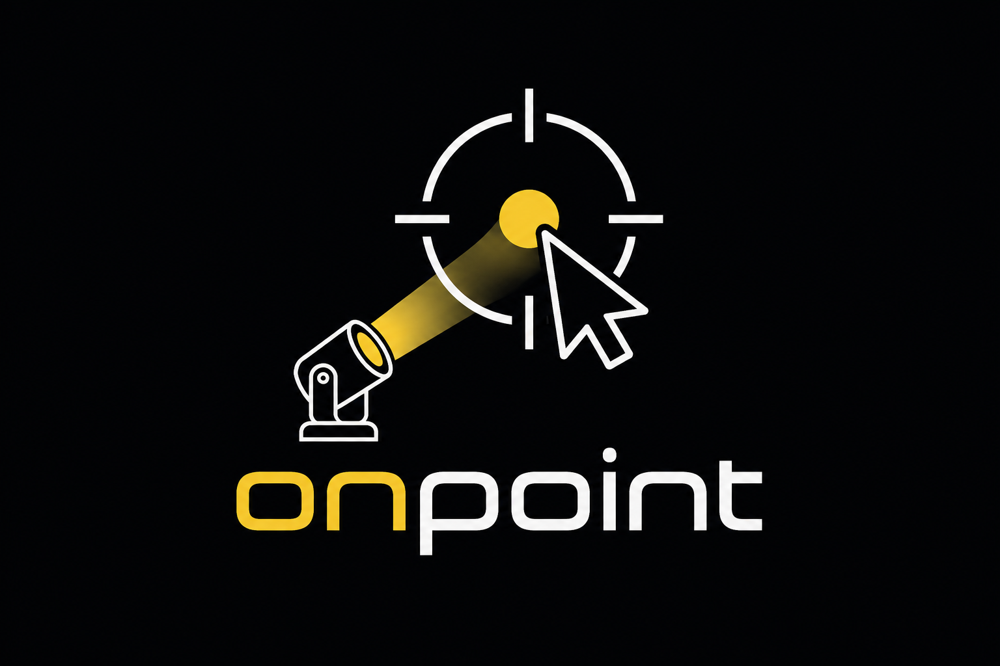

<p align="center">
  
</p>

<p align="center">
  <a href="https://github.com/hrueger/onpoint/actions/workflows/build.yml"></a>
  <a href="https://github.com/hrueger/onpoint/releases/latest"></a>
  
</p>

---

**OnPoint** is a follow-spot position tracking tool for live entertainment. An NDI camera mounted above front-of-house streams a bird's-eye view of the stage. Operators click on the video to send performer positions as **PosiStageNet (PSN v2)** UDP to a grandMA3 console. Multiple operators run simultaneously, each owning one or more tracker IDs (keys **1–9**), and see all other operators' positions overlaid on the video.

## Download

Pre-built installers for macOS (DMG) and Windows (EXE) are on the [Releases](https://github.com/hrueger/onpoint/releases) page.

## Quick start

1. Launch OnPoint and select an NDI source from the stream picker.
2. Open **Setup → Calibration…** and click at least four known stage marks, entering their real-world X/Z coordinates (metres). Click **Compute Homography**.
3. Open **Setup → Settings…** → **Network** to configure the PSN multicast address and port (defaults: `236.10.10.10:56565`).
4. Press keys **1–9** to select a tracker, then **click and hold** on the video to send its position.

## Keyboard & mouse

| Action                | Description                            |
| --------------------- | -------------------------------------- |
| Keys **1–9**          | Select active tracker                  |
| **Left click + hold** | Aim selected tracker at stage position |
| **Escape**            | Deselect all trackers                  |

## PSN network settings

| Setting      | Default        | Description                      |
| ------------ | -------------- | -------------------------------- |
| Mode         | Multicast      | Multicast, Unicast, or Broadcast |
| Multicast IP | `236.10.10.10` | Standard PSN multicast address   |
| Port         | `56565`        | Standard PSN port                |

Packets are sent at **60 Hz** (data) and **1 Hz** (info/name). Ensure IGMP snooping is configured on the switch, or enable multicast flooding.

## Project files

Projects are saved as `.onpoint` JSON files (**File → Save Project**) and store calibration, tracker configuration, NDI source, and network settings.

---

## Development

### Requirements

#### macOS

| Dependency               | Version | Install                                                                                                                             |
| ------------------------ | ------- | ----------------------------------------------------------------------------------------------------------------------------------- |
| macOS                    | 13+     | —                                                                                                                                   |
| Xcode Command Line Tools | any     | `xcode-select --install`                                                                                                            |
| CMake                    | ≥ 3.25  | `brew install cmake`                                                                                                                |
| Qt 6                     | ≥ 6.4   | `brew install qt`                                                                                                                   |
| OpenCV                   | ≥ 4     | `brew install opencv`                                                                                                               |
| NDI SDK for Apple        | 6.x     | [ndi.video](https://ndi.video/for-developers/ndi-sdk/) → macOS                                                                      |
| Blackmagic DeckLink SDK  | 16.x    | [blackmagicdesign.com](https://www.blackmagicdesign.com/developer/product/capture-and-playback) — headers bundled in `third_party/` |

#### Windows

| Dependency                | Version | Install                                                                                                                            |
| ------------------------- | ------- | ---------------------------------------------------------------------------------------------------------------------------------- |
| Windows                   | 10 / 11 | —                                                                                                                                  |
| Visual Studio Build Tools | 2022    | `winget install Microsoft.VisualStudio.2022.BuildTools`                                                                            |
| CMake                     | ≥ 3.25  | `winget install Kitware.CMake`                                                                                                     |
| Qt 6                      | 6.8.3   | `pip install aqtinstall` then `python -m aqt install-qt windows desktop 6.8.3 win64_msvc2022_64 -m qtmultimedia --outputdir C:\Qt` |
| OpenCV                    | ≥ 4     | via vcpkg: `vcpkg install opencv:x64-windows`                                                                                      |
| NDI SDK for Windows       | 6.x     | [ndi.video](https://ndi.video/for-developers/ndi-sdk/) → Windows                                                                   |
| Blackmagic DeckLink SDK   | 16.x    | headers in `third_party/decklink/Win/include/`                                                                                     |
| Apple Bonjour SDK         | any     | [developer.apple.com](https://developer.apple.com/download/all/?q=Bonjour+SDK+for+Windows)                                         |

### Build

**macOS**

```bash
brew install cmake qt opencv
cmake -B build -DCMAKE_BUILD_TYPE=Release
cmake --build build --parallel
open build/onpoint.app
```

> Tip: pass `-DCMAKE_PREFIX_PATH=/opt/homebrew` if Qt or OpenCV are not found.

**Windows** (PowerShell)

```powershell
cmake -S . -B build -A x64 -DCMAKE_BUILD_TYPE=Release `
  "-DCMAKE_PREFIX_PATH=C:\Qt\6.8.3\msvc2022_64;C:\vcpkg\installed\x64-windows" `
  -DCMAKE_TOOLCHAIN_FILE="C:\vcpkg\scripts\buildsystems\vcpkg.cmake"
cmake --build build --config Release --parallel
C:\Qt\6.8.3\msvc2022_64\bin\windeployqt.exe build\Release\onpoint.exe
```

### Windows installer

```powershell
makensis /DVERSION=x.y.z packaging\windows.nsi
```
